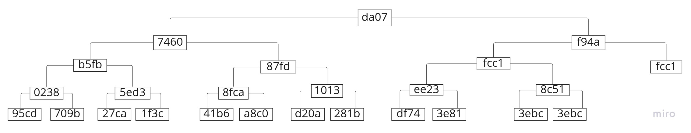
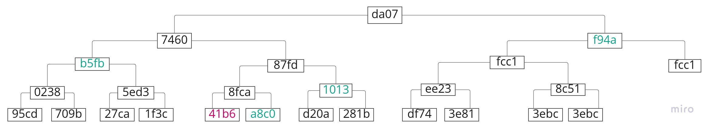

# Merkle Tree, a simple explanation and implementation

The purpose of this article is to have a basic, but complete understanding of the Merkle Tree and it’s implementation.
Since I couldn’t find an article covering the implementation of the Merkle tree creation, Merkle root, Merkle Proof and validation, I decided to implement a basic solution and create this article with my findings to share with the community.


- [Merkle Tree, a simple explanation and implementation](#merkle-tree-a-simple-explanation-and-implementation)
  - [Merkle Tree](#merkle-tree)
  - [Basic Implementation](#basic-implementation)

## Merkle Tree

A Merkle Tree is a tree data structure (typically a binary tree) of hashes, where each leaf node contains the hash of a block of data, and each parent node contains the hash resulting from the concatenation and hashing of its children node's hashes.

This tree is used to verify and demonstrate that the hash of a leaf node is part of the hash of the root node in an efficient way, since we only need a small set of the hashes of the tree to carry out this verification.

This data structure is often used in distributed systems, like in Bitcoin and other blockchains, to verify if a transaction hash belongs to the Merkle root of a block header, in a lightweight, efficient and fast way.

The use of Merkle Tree/Root/Proof in Bitcoin allows the implementation of Simple Payment Verification (SPV), which is a way for lightweight clients to check if a transaction is actually part of a block, without the client having to download the whole block or the whole blockchain.
By only having the block header with the Merkle root, the transaction it wants to verify and the Merkle proof structure, obtained from a trusted bitcoin node, it can try to reconstruct the Merkle root and validate the transaction.

Ralph Merkle patented the hash tree in 1979, later named after him.

**Example of a Merke Tree**

From a list of hashes:

```
[95cd, 709b, 27ca, 1f3c, 41b6, a8c0, d20a, 281b, df74, 3e81]
```

Its Merkle tree would look like:



<sub><sup>(These 4 characters hashes are short for longer, 64 characters hashes, to be shown later in the article</sup></sub>

Notice how the last hash, `3e81`, was copied and added to the end of the list. This is needed to be able to concatenate it with itself and hash it, since we hash in pair and if the hash list length is odd, then we copy and add the last to make the hash list even. The same happens with `fcc1`.
Each of the tree levels is called a hash list.

**Merkle Root**

The Merkle root is the root node of the tree. In our example above, it's the node with the **`da07`** hash.

**Merkle Proof**

A Merkle proof is a structure that holds the minimum needed hashes/nodes of a branch tree to be able to proof that a hash belongs to the Merkle root by recreating the Merkle root only with this information.

For example:



If we are interested in verifying if the hash *`41b6`* is actually included in the Merkle root (**`da07`**) then we would only need to have the hashes in color:

```
[41b6, a8c0, 1013, b5fb, f94a]
```

With `41b6`, we need `a8c0` to reconstruct `8fca`.
With `8fca`, we need `1013` to reconstruct `87fd`.
With `87fd`, we need `b5fb` to reconstruct `7460`.
With `7460` we need `f94a` to reconstruct **`da07`**, the Merkle root.

If after applying our hash (*`41b6`*) to the Merkle proof we get the expected **`da07`** Merkle root, then we know that our hash is part of the Merkle root.

In this case, for 11 hashes, we only needed 4 hashes, along our hash *`41b6`* to be able to reconstruct the Merkle root **`da07`**.

With this information, we notice a pattern and we can determine that we only need about log(n) number of nodes to be able to check if a hash belongs to a certain Merkle root, which is really efficient, instead of having to hash them all to verify that.

Something important that we need to have in mind is the order of concatenation of the hashes when we are creating and using the Merkle proof before hashing them:

*`41b6`* needs to be concatenated with `a8c0`, `41b6` being on the left and `a8c0` on the right:

```js
//...
const concatenatedHashes = '41b6' + 'a8c0';
//...
```
Because `41b6` is a left child, and `a8c0` is a right child.

The resulting hash `8fca` from the previous concatenation and hashing needs to be concatenated with `1013`, `8fca` being on the left and `1013` on the right, because `8fca` is a left child and `1013` is a right child.

The resulting hash `87fd` from the previous concatenation and hashing needs to be concatenated with `b5fb`, `87fd` being on the right and `b5fb` on the left, because `87fd` is a right child and `b5fb` is a left child.

The resulting hash `7460` from the previous concatenation and hashing needs to be concatenated with `f94a`, `7460` being on the left and `f94a` on the right, because `7460` is a left child and `f94a` is a right child.

We need to specify in the Merkle proof structure this direction that each node belongs to:

```js
const merkleProofFor41b6 = [
{
    hash: '41b6',
    direction: 'left'
},
{
    hash: 'a8c0',
    direction: 'right'
},
{
    hash: '1013',
    direction: 'right'
},
{
    hash: 'b5fb',
    direction: 'left'
},
{
    hash: 'f94a',
    direction: 'right'
}]
```
With this, our Merkle proof is complete and ready to be transferred and used.

## Basic Implementation

Blockchains like Bitcoin use Merkle trees to check if a transaction belongs to the Merkle root in a block header.
Each software using the Merkle tree structure is free to use any implementation they see fit.

Bitcoin, for example, converts the concatenated hash to binary first, before hashing it.
Bitcoin also uses a double sha256 hash, something like:

```js
    const result = sha256(sha256(binaryOfTheConcatenatedPairOfHashes))
```

I'm going to keep our implementation as simple as possible, just to try to see and understand the concept easily, just the bare minimum.

Our implementation will be in nodejs.

We are going to use `sha256` to hash the concatenation of our hashes. So, we will have 64 characters hashes.

Each function will have some documentation to help clarify what it does.

First, we import the `crypto` module:

```js
import crypto from 'crypto';
```

Define a couple of direction constants:

```js
const LEFT = 'left';
const RIGHT = 'right';
```

We will define a list of random sha256 hashes to work with:

```js
const hashes = [
    '95cd603fe577fa9548ec0c9b50b067566fe07c8af6acba45f6196f3a15d511f6',
    '709b55bd3da0f5a838125bd0ee20c5bfdd7caba173912d4281cae816b79a201b',
    '27ca64c092a959c7edc525ed45e845b1de6a7590d173fd2fad9133c8a779a1e3',
    '1f3cb18e896256d7d6bb8c11a6ec71f005c75de05e39beae5d93bbd1e2c8b7a9',
    '41b637cfd9eb3e2f60f734f9ca44e5c1559c6f481d49d6ed6891f3e9a086ac78',
    'a8c0cce8bb067e91cf2766c26be4e5d7cfba3d3323dc19d08a834391a1ce5acf',
    'd20a624740ce1b7e2c74659bb291f665c021d202be02d13ce27feb067eeec837',
    '281b9dba10658c86d0c3c267b82b8972b6c7b41285f60ce2054211e69dd89e15',
    'df743dd1973e1c7d46968720b931af0afa8ec5e8412f9420006b7b4fa660ba8d',
    '3e812f40cd8e4ca3a92972610409922dedf1c0dbc68394fcb1c8f188a42655e2',
    '3ebc2bd1d73e4f2f1f2af086ad724c98c8030f74c0c2be6c2d6fd538c711f35c',
    '9789f4e2339193149452c1a42cded34f7a301a13196cd8200246af7cc1e33c3b',
    'aefe99f12345aabc4aa2f000181008843c8abf57ccf394710b2c48ed38e1a66a',
    '64f662d104723a4326096ffd92954e24f2bf5c3ad374f04b10fcc735bc901a4d',
    '95a73895c9c6ee0fadb8d7da2fac25eb523fc582dc12c40ec793f0c1a70893b4',
    '315987563da5a1f3967053d445f73107ed6388270b00fb99a9aaa26c56ecba2b',
    '09caa1de14f86c5c19bf53cadc4206fd872a7bf71cda9814b590eb8c6e706fbb',
    '9d04d59d713b607c81811230645ce40afae2297f1cdc1216c45080a5c2e86a5a',
    'ab8a58ff2cf9131f9730d94b9d67f087f5d91aebc3c032b6c5b7b810c47e0132',
    'c7c3f15b67d59190a6bbe5d98d058270aee86fe1468c73e00a4e7dcc7efcd3a0',
    '27ef2eaa77544d2dd325ce93299fcddef0fae77ae72f510361fa6e5d831610b2'
];

```


We will define a utility function to help us abstract the sha256 hashing with the crypto module:

```js
const sha256 = data => {
    return crypto
        .createHash('sha256')
        .update(data)
        .digest()
        .toString('hex');
};
```

Define a utility function to calculate if a leaf node is a left or right child:

```js
/**
 * Finds the index of the hash in the leaf hash list of the Merkle tree
 * and verifies if it's a left or right child by checking if its index is
 * even or odd. If the index is even, then it's a left child, if it's odd,
 * then it's a right child.
 * @param {string} hash 
 * @param {Array<Array<string>>} MerkleTree 
 * @returns {string} direction
 */
const getLeafNodeDirectionInMerkleTree = (hash, MerkleTree) => {
    const hashIndex = MerkleTree[0].findIndex(h => h === hash);
    return hashIndex % 2 === 0 ? LEFT : RIGHT;
};
```

Define a utility function to check if a list of hashes has an odd length, and if so, copy the last hash and add it to the end of the hash list:

```js
/**
 * If the hashes length is not even, then it copies the last hash and adds it to the
 * end of the array, so it can be hashed with itself.
 * @param {Array<string>} hashes
 */
 function ensureEven(hashes) {
    if(hashes.length % 2 !== 0) {
        hashes.push(hashes[hashes.length - 1]);
    }
}
```

Define the function that will receive a hash list and calculate and return the Merkle root, recursively:

```js
/**
 * Generates the Merkle root of the hashes passed through the parameter.
 * Recursively concatenates pair of hashes and calculates each sha256 hash of the
 * concatenated hashes until only one hash is left, which is the Merkle root, and returns it.
 * @param {Array<string>} hashes
 * @returns merkleRoot
 */
function generateMerkleRoot(hashes) {
    if(!hashes || hashes.length == 0) {
        return '';
    }
    ensureEven(hashes);
    const combinedHashes = [];
    for(let i = 0; i < hashes.length; i += 2) {
        const hashPairConcatenated = hashes[i] + hashes[i + 1];
        const hash = sha256(hashPairConcatenated);
        combinedHashes.push(hash);
    }
    // If the combinedHashes length is 1, it means that we have the Merkle root already
    // and we can return
    if(combinedHashes.length === 1) {
        return combinedHashes.join('');
    }
    return generateMerkleRoot(combinedHashes);
}
```

We can test this code by calling the `generateMerkleRoot` with the list of hashes:

```js
const merkleRoot = generateMerkleRoot(hashes);
console.log('merkleRoot: ', merkleRoot);
```

This would print:

```
merkleRoot: 68e6cdf0cae7fb8eef39cc899c8882e34dd1727a2d08f2303811886949c539e6
```

Let's now generate the Merkle tree:

```js
/**
 * Creates a Merkle tree, recursively, from the provided hashes, represented
 * with an array of arrays of hashes/nodes. Where each array in the array, or hash list,
 * is a tree level with all the hashes/nodes in that level.
 * In the array at position tree[0] (the first array of hashes) there are
 * all the original hashes.
 * In the array at position tree[1] there are the combined pair or sha256 hashes of the
 * hashes in the position tree[0], and so on.
 * In the last position (tree[tree.length - 1]) there is only one hash, which is the
 * root of the tree, or Merkle root.
 * @param {Array<string>} hashes 
 * @returns {Array<Array<string>>} merkleTree
 */
function generateMerkleTree(hashes) {
    if(!hashes || hashes.length === 0) {
        return [];
    }
    const tree = [hashes];
    const generate = (hashes, tree) => {
        if(hashes.length === 1) {
            return hashes;
        }
        ensureEven(hashes);
        const combinedHashes = [];
        for(let i = 0; i < hashes.length; i += 2) {
            const hashesConcatenated = hashes[i] + hashes[i + 1];
            const hash = sha256(hashesConcatenated);
            combinedHashes.push(hash);
        }
        tree.push(combinedHashes);
        return generate(combinedHashes, tree);
    }
    generate(hashes, tree);
    return tree;
}
```

We can try out this function by calling it with the hashes:

```js
const merkleTree = generateMerkleTree(hashes);
console.log('merkleTree: ', merkleTree);
```

This will long something like:

```js
merkleTree:  [
  [
    '95cd603fe577fa9548ec0c9b50b067566fe07c8af6acba45f6196f3a15d511f6',
    '709b55bd3da0f5a838125bd0ee20c5bfdd7caba173912d4281cae816b79a201b',
    '27ca64c092a959c7edc525ed45e845b1de6a7590d173fd2fad9133c8a779a1e3',
    '1f3cb18e896256d7d6bb8c11a6ec71f005c75de05e39beae5d93bbd1e2c8b7a9',
    '41b637cfd9eb3e2f60f734f9ca44e5c1559c6f481d49d6ed6891f3e9a086ac78',
    'a8c0cce8bb067e91cf2766c26be4e5d7cfba3d3323dc19d08a834391a1ce5acf',
    'd20a624740ce1b7e2c74659bb291f665c021d202be02d13ce27feb067eeec837',
    '281b9dba10658c86d0c3c267b82b8972b6c7b41285f60ce2054211e69dd89e15',
    'df743dd1973e1c7d46968720b931af0afa8ec5e8412f9420006b7b4fa660ba8d',
    '3e812f40cd8e4ca3a92972610409922dedf1c0dbc68394fcb1c8f188a42655e2',
    '3ebc2bd1d73e4f2f1f2af086ad724c98c8030f74c0c2be6c2d6fd538c711f35c',
    '9789f4e2339193149452c1a42cded34f7a301a13196cd8200246af7cc1e33c3b',
    'aefe99f12345aabc4aa2f000181008843c8abf57ccf394710b2c48ed38e1a66a',
    '64f662d104723a4326096ffd92954e24f2bf5c3ad374f04b10fcc735bc901a4d',
    '95a73895c9c6ee0fadb8d7da2fac25eb523fc582dc12c40ec793f0c1a70893b4',
    '315987563da5a1f3967053d445f73107ed6388270b00fb99a9aaa26c56ecba2b',
    '09caa1de14f86c5c19bf53cadc4206fd872a7bf71cda9814b590eb8c6e706fbb',
    '9d04d59d713b607c81811230645ce40afae2297f1cdc1216c45080a5c2e86a5a',
    'ab8a58ff2cf9131f9730d94b9d67f087f5d91aebc3c032b6c5b7b810c47e0132',
    'c7c3f15b67d59190a6bbe5d98d058270aee86fe1468c73e00a4e7dcc7efcd3a0',
    '27ef2eaa77544d2dd325ce93299fcddef0fae77ae72f510361fa6e5d831610b2',
    '27ef2eaa77544d2dd325ce93299fcddef0fae77ae72f510361fa6e5d831610b2'
  ],
  [
    '02385a4dd6c9f58a120b18a41f416e57e33dc53d68e5a27ef1965ce6b3755115',
    '5ed38700528736c566fcff731d6b87a9c5659faf2766650130a1b99f29b9ba5c',
    '8fca72ca8ee89e32a7483de0f66ee262e01012126cee65563fdee5ac36b8903c',
    '1013dc83aed099eafbd769ded32f5269fff327994161ecc547bf38117a5acaa0',
    'ee23a64ac92622b3f93f7530398a49085a51ed51dfdfa64673b1e5ff67033c19',
    '9e5eaaea2fce5d2e8aff5b44a24fc368108cddae7018ff2f6eb3eff7181d73e8',
    '3ed59e8098265d6e3cca3698414225704ae45e163a8b52d417089c3500b695c8',
    'a7a31b62976e1eb902c3fd0c8b81875e420fc93f296a8d1d39a6e568d158c5af',
    'fd31ed361650efa2e58618234980bcb66c4a7c1ff82a860fc3e2ec659021ea85',
    '83aae9b428a7b08ab0358075218fce9b99683249b22629905c6bbbd44878a221',
    'db148d59d83b9c0ab166e77eff0e62ed985baa52b0f30d5d46f10bd1a0637ed2',
    'db148d59d83b9c0ab166e77eff0e62ed985baa52b0f30d5d46f10bd1a0637ed2'
  ],
  [
    'b5fb96a64aa54c2368eb31066edb453ced97305fb795a1449a751e7d3e053317',
    '87fd9f95dfc5a08eec3cb6e729d7bfa6b414881d8aaf4ebebd665cc046906a69',
    '672d1645d37fb3a2e22a121b6b795c5bb133240ac70f4b350f922bd59df633d9',
    '954b44c666331f7d0801b2ce2e9bc8b36458a9702d916d5b3de3ed92a7f61fb0',
    '28c15c7c6699cdbe6742b153804f3ac32e9a22bf452e4c08c120b2ece38c790a',
    '97714c83de18bb17c16ce70524ea9a3cb0747abc6ba6a365611db0c2f2f782f9'
  ],
  [
    '7460f3909db58457a0a3384cd2167baf744a6b03125a220e083df80eaa781fbd',
    '2993546ae04f8a64f0a9051932cc179bc0f7c74d8254066fb8e24fd49e9bf131',
    '071cea0cc9a8a394874a2e3d53bdf5eff6708db2517029a1562d0af1b4bfadfc',
    '071cea0cc9a8a394874a2e3d53bdf5eff6708db2517029a1562d0af1b4bfadfc'
  ],
  [
    '9a9109481828dcdf08574ebb3129790f5f3229dbb733533cf9488bad0a9c0d6b',
    'e22239034a17a55feaab2c577763a3997873b47fe893761efef923a12887d2b7'
  ],
  [
    '68e6cdf0cae7fb8eef39cc899c8882e34dd1727a2d08f2303811886949c539e6'
  ]
]

```

Let's now generate the Merkle Proof structure:

```js

/**
 * Generates the Merkle proof by first creating the Merkle tree,
 * and then finding the hash index in the tree and calculating if it's a 
 * left or right child (since the hashes are calculated in pairs, 
 * the hash at index 0 would be a left child, the hash at index 1 would be a right child.
 * Even indices are left children, odd indices are right children),
 * then it finds the sibling node (the one needed to concatenate and hash it with the child node)
 * and adds it to the proof, with its direction (left or right)
 * then it calculates the position of the next node in the next level, by
 * dividing the child index by 2, so this new index can be used in the next iteration of the
 * loop, along with the level.
 * If we check the result of this representation of the Merkle tree, we notice that
 * The first level has all the hashes, an even number of hashes.
 * All the levels have an even number of hashes, except the last one (since is the 
 * Merkle root)
 * The next level have half or less hashes than the previous level, which allows us
 * to find the hash associated with the index of a previous hash in the next level in constant time.
 * Then we simply return this Merkle proof.
 * @param {string} hash 
 * @param {Array<string>} hashes 
 * @returns {Array<node>} merkleProof
 */
function generateMerkleProof(hash, hashes) {
    if(!hash || !hashes || hashes.length === 0) {
        return null;
    }
    const tree = generateMerkleTree(hashes);
    const merkleProof = [{
        hash,
        direction: getLeafNodeDirectionInMerkleTree(hash, tree)
    }];
    let hashIndex = tree[0].findIndex(h => h === hash);
    for(let level = 0; level < tree.length - 1; level++) {
        const isLeftChild = hashIndex % 2 === 0;
        const siblingDirection = isLeftChild ? RIGHT : LEFT;
        const siblingIndex = isLeftChild ? hashIndex + 1 : hashIndex - 1;
        const siblingNode = {
            hash: tree[level][siblingIndex],
            direction: siblingDirection
        };
        merkleProof.push(siblingNode);
        hashIndex = Math.floor(hashIndex / 2);
    }
    return merkleProof;
}
```

Let's call it with a hash and the list of hashes:

```js
const generatedMerkleProof = generateMerkleProof(hashes[4], hashes);
console.log('generatedMerkleProof: ', generatedMerkleProof);
```

And it logs:

```js
generatedMerkleProof:  [
  {
    hash: '41b637cfd9eb3e2f60f734f9ca44e5c1559c6f481d49d6ed6891f3e9a086ac78',
    direction: 'left'
  },
  {
    hash: 'a8c0cce8bb067e91cf2766c26be4e5d7cfba3d3323dc19d08a834391a1ce5acf',
    direction: 'right'
  },
  {
    hash: '1013dc83aed099eafbd769ded32f5269fff327994161ecc547bf38117a5acaa0',
    direction: 'right'
  },
  {
    hash: 'b5fb96a64aa54c2368eb31066edb453ced97305fb795a1449a751e7d3e053317',
    direction: 'left'
  },
  {
    hash: '2993546ae04f8a64f0a9051932cc179bc0f7c74d8254066fb8e24fd49e9bf131',
    direction: 'right'
  },
  {
    hash: 'e22239034a17a55feaab2c577763a3997873b47fe893761efef923a12887d2b7',
    direction: 'right'
  }
];
```

Now, let's add a function to verify if a hash is part of a Merkle root, by reconstructing a Merkle root from the Merkle proof structure:

```js
/**
 * Calculates the Merkle root using the Merkle proof by concatenating each pair of
 * hashes with the correct tree branch direction (left, right) and calculating
 * the sha256 hash of the concatenated pair, until the Merkle root hash is generated 
 * and returned.
 * The first hash needs to be in the first position of this array, with its
 * corresponding tree branch direction.
 * @param {Array<node>} merkleProof 
 * @returns {string} merkleRoot
 */
function getMerkleRootFromMerkleProof(merkleProof) {
    if(!merkleProof || merkleProof.length === 0) {
        return '';
    }
    const merkleRootFromProof = merkleProof.reduce((hashProof1, hashProof2) => {
        if(hashProof2.direction === RIGHT) {
            const hash = sha256(hashProof1.hash + hashProof2.hash);
            return { hash };
        }
        const hash = sha256(hashProof2.hash + hashProof1.hash);
        return { hash };
    });
    return merkleRootFromProof.hash;
}
```

Let's call it and check its result against our expected Merkle root:

```js
const merkleRootFromMerkleProof = getMerkleRootFromMerkleProof(generatedMerkleProof);

console.log('merkleRootFromMerkleProof: ', merkleRootFromMerkleProof);
console.log('merkleRootFromMerkleProof === merkleRoot: ', merkleRootFromMerkleProof === merkleRoot);
```

This will log:

```js
merkleRootFromMerkleProof:  68e6cdf0cae7fb8eef39cc899c8882e34dd1727a2d08f2303811886949c539e6
merkleRootFromMerkleProof === merkleRoot:  true
```

Nice.

References:

https://learnmeabitcoin.com/technical/Merkle-root
https://en.wikipedia.org/wiki/Merkle_tree
